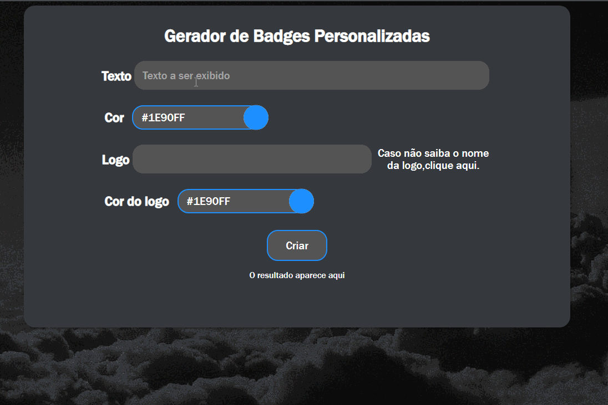

# Site gerador de badges para github

Este site gera o código necessário para personalizar suas badges e deixar da forma que você quiser! É bem simples de usar e bem intuitivo. 

### :white_check_mark: Tecnologias utlizadas

# :computer: Como usar o projeto:

Para usar o projeto basta preenche os campos:

### Texto
Define o texto que será exibido dentro do badge

### Cor
Escolhe a cor da figurinha

### Logo
Define qual desenho será exibido dentro do badge

### Cor do logo
Define qual será a cor do ícone do logo

Em seguida clicar em **[Criar]** e pronto!   
:tada: Sue link estará pronto para ser copiado e utilizado